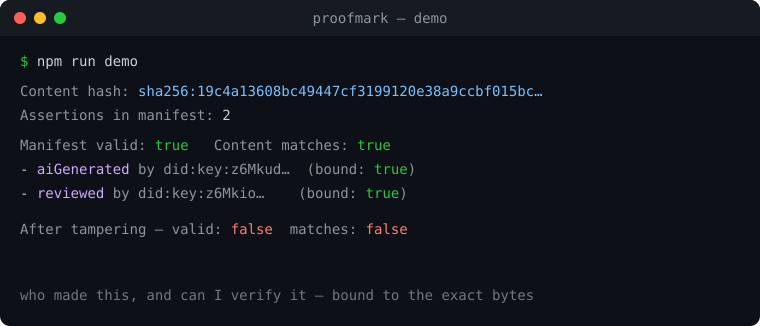

# proofmark

**Proveniência de conteúdo que consegues mesmo verificar.** Assina *o que criou ou
editou* um conteúdo — um modelo de IA, uma ferramenta, uma pessoa — como Verifiable
Credentials W3C **ligadas criptograficamente aos bytes exatos**. Um sidecar de
proveniência ao estilo C2PA, offline e leve.

🌍 [English](README.md) · **[Português](README.pt.md)** · 📚 [Documentação](docs/README.md)

<p align="center"></p>

[](https://github.com/marcelogdomingues/proofmark/actions/workflows/ci.yml)
[](https://www.npmjs.com/package/proofmark)
[](LICENSE)

## Porquê

"Isto foi gerado por IA?" é a pergunta errada — não consegues detetar isso de forma
fiável à posteriori. A pergunta certa é **"quem afirma ter feito isto, e consigo
verificar?"**. O proofmark responde: cada ator *assina* uma afirmação (criado /
editado / `aiGenerated` / revisto) ligada ao hash do conteúdo. Muda um byte e a
verificação falha. Espelha o modelo do [C2PA](https://c2pa.org) de afirmações
assinadas, usando Verifiable Credentials portáteis em vez de manifestos embebidos.

## Instalação

```bash
npm install proofmark
```

## Começar rápido

```ts
import { createIdentity, stamp, addAssertion, verifyManifest } from 'proofmark';

const ferramentaAI = createIdentity();
const revisor = createIdentity();
const conteudo = 'Um artigo redigido por IA e depois revisto por um humano.';

// A ferramenta de IA carimba o que gerou…
let manifest = await stamp(ferramentaAI, conteudo, { action: 'aiGenerated', tool: 'claude-fable-5' });
// …um revisor humano assina sobre os mesmos bytes.
manifest = await addAssertion(manifest, revisor, conteudo, { action: 'reviewed', tool: 'human' });

const resultado = await verifyManifest(conteudo, manifest);
console.log(resultado.valid);          // true
console.log(resultado.contentMatches); // true — passa a false se mudar um byte
```

Corre o demo: `npm run demo`.

## API

| Função | Objetivo |
| --- | --- |
| `createIdentity(seed?)` | Identidade `did:key` Ed25519 para um signatário (ferramenta de IA ou pessoa). |
| `hashContent(data)` | Hash de ligação ao conteúdo (`"sha256:…"`). |
| `stamp(signer, content, assertion)` | Faz hash + cria um manifesto com uma afirmação assinada. |
| `addAssertion(manifest, signer, content, assertion)` | Acrescenta outra afirmação assinada. |
| `signAssertion(signer, hash, assertion)` | Baixo nível: assina uma VC de afirmação. |
| `verifyManifest(content, manifest)` | Recalcula o hash, verifica todas as assinaturas + ligação. |

Uma **afirmação** tem `action` (`created` \| `edited` \| `aiGenerated` \| `reviewed`
\| `published`), um `tool` opcional, `createdAt` e `meta` livre.

## O que é (e o que não é)

- ✅ Proveniência portátil, offline e verificável para quaisquer bytes (texto, imagens, ficheiros).
- ✅ Cadeias com vários atores (gerador → editor → revisor → publicador).
- ⚠️ **Não** embebe um manifesto dentro de um JPEG/PNG como o C2PA completo — é um
  **sidecar destacado** ligado por hash. Ver [docs/pt/vs-c2pa.md](docs/pt/vs-c2pa.md).
- ⚠️ Prova *quem assinou uma afirmação*, não que a afirmação é verdadeira. A confiança
  está ancorada em que DIDs de signatários aceitas.

## Licença

MIT © Marcelo Domingues
