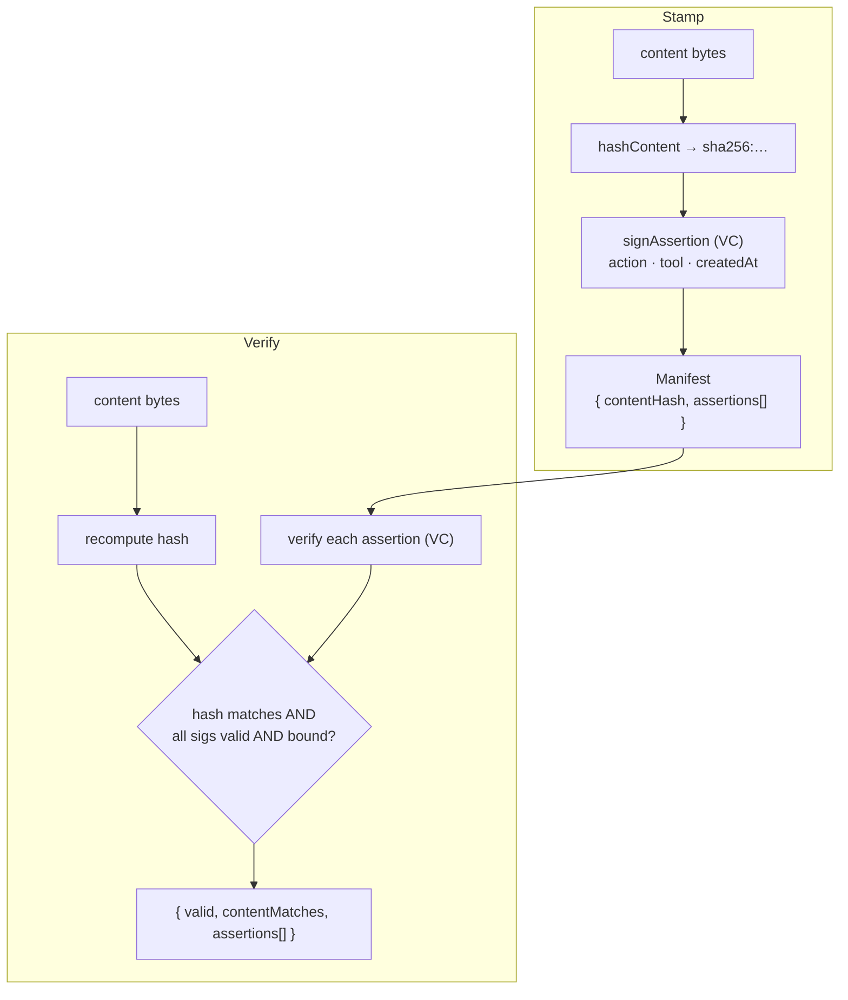

# Architecture

proofmark binds signed assertions to content by hash. Signing produces a detached manifest;
verification recomputes the hash and checks every assertion's signature and binding.

## Module map

| Module | Responsibility |
| --- | --- |
| `hash.ts` | Content-binding hash (`sha256:…`) and comparison |
| `did.ts` | Ed25519 `did:key` signer identities |
| `manifest.ts` | Sign assertions, build/extend manifests, verify |

## Design principles

- **Content-bound** — every assertion embeds the hash; change a byte and verification fails.
- **Detached sidecar** — the manifest is portable JSON; store it anywhere (unlike embedded C2PA).
- **Proves signer, not truth** — trust depends on which signer DIDs you accept.
- **Any bytes** — text, images, PDFs; the API takes `Uint8Array`.
