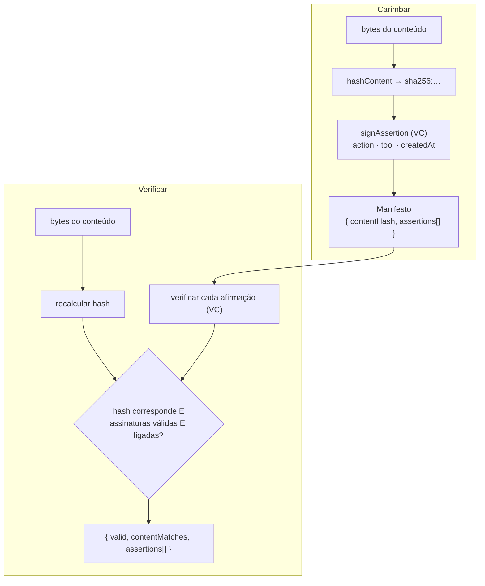

# Arquitetura

O proofmark liga afirmações assinadas ao conteúdo por hash. Assinar produz um manifesto
destacado; a verificação recalcula o hash e valida a assinatura e a ligação de cada afirmação.

## Mapa de módulos

| Módulo | Responsabilidade |
| --- | --- |
| `hash.ts` | Hash de ligação ao conteúdo (`sha256:…`) e comparação |
| `did.ts` | Identidades signatárias `did:key` Ed25519 |
| `manifest.ts` | Assinar afirmações, construir/estender manifestos, verificar |

## Princípios de design

- **Ligado ao conteúdo** — cada afirmação embebe o hash; muda um byte e a verificação falha.
- **Sidecar destacado** — o manifesto é JSON portátil; guarda-o onde quiseres (ao contrário do C2PA embebido).
- **Prova o signatário, não a verdade** — a confiança depende de que DIDs de signatários aceitas.
- **Quaisquer bytes** — texto, imagens, PDFs; a API recebe `Uint8Array`.
